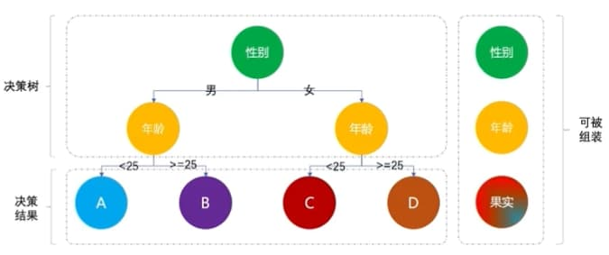

### 应用1：营销发券决策树

### 应用2：订单超时赔付中心
规则配置中心：
 - 晴天 && 超时5分钟  && 优质用户  --> 赔5元券
 - 小雨 && 超时10分钟 && 普通用户 --> 赔5元券
 - 小雨 && 超时10分钟 && 优质用户 --> 赔10元券
 - 中雨 && 超时15分钟 && 风控用户 --> 无赔付
 - 中雨 && 超时15分钟 && 普通用户 --> 赔5元券
 - 中雨 && 超时15分钟 && 普通用户 --> 赔10元券
 - 大到暴雨 --> 无赔付
 - 台风    --> 无赔付

### 应用3：商品列表页标签展示规则

